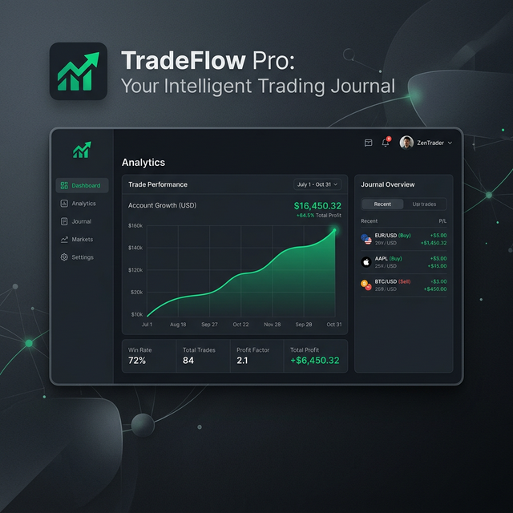

# 🧘‍♂️ TradeFlow Pro — Zen Trading Journal



> **Elevate your trading psychology with a minimalist, high-performance journal inspired by the Zen Browser aesthetic.**

TradeFlow Pro is a professional-grade trading journal designed for traders who value clarity, discipline, and data-driven growth. It combines a stunning "Zen" UI with powerful analytics, cloud synchronization, and full PWA support.

---

## ✨ Key Features

### 💎 Zen UI/UX
- **Floating Layout**: A modern, glassmorphic interface that reduces clutter and focuses on what matters—your trades.
- **Premium Icons**: Custom-optimized iconography for a professional fintech feel (no emojis).
- **Micro-Animations**: Subtle, smooth transitions and hover effects for a premium experience.

### ☁️ Google Cloud Integration
- **One-Tap Login**: Secure authentication via Google (Firebase).
- **Real-Time Sync**: Your trades, settings, and journal entries are instantly synced to Firestore.
- **Per-Account Isolation**: Personalized starting capital, currency preferences, and theme settings for every account.

### 📊 Advanced Analytics & Exports
- **Performance Dashboard**: Real-time tracking of Win Rate, Profit Factor, and Cumulative P&L.
- **Analytical Reports**: Export high-fidelity PDF reports featuring Strategy Matrices and Behavioral Analysis (Mistake Tracking).
- **Data Portability**: Full CSV archive exports for external spreadsheet analysis.

### 📱 Progressive Web App (PWA)
- **Installable**: Add TradeFlow Pro to your Home Screen or Desktop as a standalone app.
- **Offline Capable**: Fast loading and basic offline support via Service Worker.
- **iOS Optimized**: Native feel on mobile devices with custom icons and splash configurations.

---

## 🛠️ Technology Stack
- **Frontend**: Vanilla JavaScript (ES6+), HTML5, CSS3.
- **Database**: Firebase Firestore.
- **Auth**: Firebase Google Authentication.
- **Charts**: Chart.js.
- **Reports**: jsPDF & AutoTable.
- **Icons**: Font Awesome 6 Pro.

---

## 🚀 Getting Started

### Prerequisites
To use the cloud sync features, you'll need a Firebase project.
1. Create a project at [Firebase Console](https://console.firebase.google.com/).
2. Enable **Firestore Database** and **Google Authentication**.
3. Copy your Web SDK Config into the `firebaseConfig` object in `script.js`.

### Launching the App
1.  **Clone the Repo**:
    ```bash
    git clone https://github.com/yourusername/tradeflow-pro.git
    cd tradeflow-pro
    ```
2.  **Run Locally**:
    Since this is a PWA with a Service Worker, it's best to run it through a local server:
    ```bash
    # Using python
    python -m http.server 8000
    # Or using npx
    npx serve .
    ```
3.  **Access**: Open `http://localhost:8000` in your browser.

---

## 🧘‍♂️ Philosophies of TradeFlow
- **Simplicity**: No complex menus. Just your data and your progress.
- **Discipline**: Integrated mistake tracking helps you spotFOMO and Revenge Trading early.
- **Flow**: A UI that breathes, helping you maintain a calm state of mind during market hours.

---

*Handcrafted with ❤️ for the Professional Trader.*
